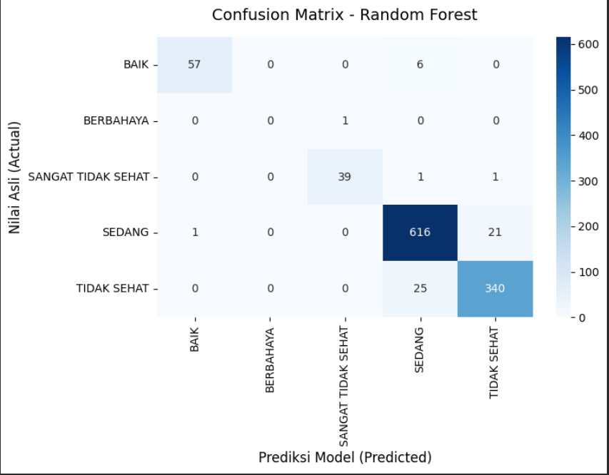
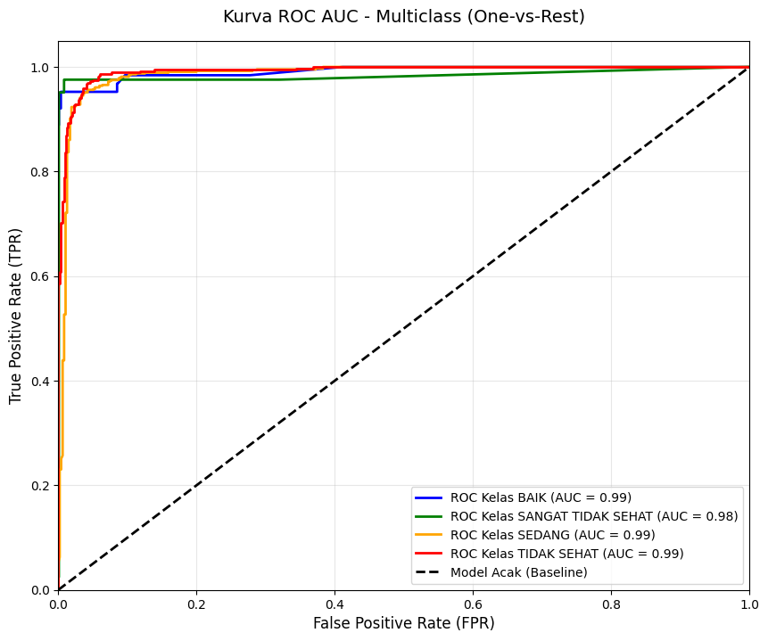
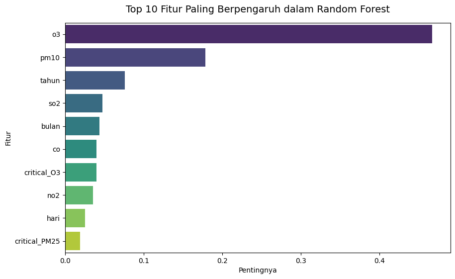

# 🌫️ Air Quality Classification in DKI Jakarta using Random Forest

<p align="center">
  
  
  
  
  
</p>

---

## 📌 Project Overview

This project aims to classify **Jakarta Air Quality (ISPU)** into four categories using a **Random Forest Classifier**.

The model predicts air quality based on pollutant concentrations measured from five monitoring stations across DKI Jakarta.

The project focuses not only on achieving high accuracy but also on implementing proper Machine Learning practices such as:

- Preventing Data Leakage
- Handling Imbalanced Dataset
- Robust Data Preprocessing
- Model Evaluation using multiple metrics
- Feature Importance Analysis

---

# 📚 Table of Contents

- Project Overview
- Dataset
- Objectives
- Tech Stack
- Workflow
- Repository Structure
- Results
- Key Findings
- How to Run
- Author

---

# 📊 Dataset

**Source**

https://www.kaggle.com/datasets/senadu34/air-quality-index-in-jakarta-2010-2021

Dataset contains daily ISPU observations from **2010–2021** collected by five monitoring stations in Jakarta.

Main pollutant variables:

- PM10
- SO₂
- CO
- O₃
- NO₂

Target variable:

- BAIK
- SEDANG
- TIDAK SEHAT
- SANGAT TIDAK SEHAT

---

# 🎯 Objectives

The objectives of this project are:

- Build a multiclass classification model using Random Forest.
- Prevent data leakage during preprocessing.
- Handle highly imbalanced classes.
- Evaluate model robustness using Macro F1-Score.
- Identify the most influential pollutants affecting air quality.

---

# 🛠 Tech Stack

| Category | Tools |
|-----------|--------|
| Language | Python |
| Notebook | Google Colab |
| ML Library | Scikit-Learn |
| Data Processing | Pandas, NumPy |
| Visualization | Matplotlib, Seaborn |
| Model | Random Forest |
| Serialization | Pickle |

---

# 🔄 Machine Learning Pipeline

```
Raw Dataset
      │
      ▼
Exploratory Data Analysis
      │
      ▼
Data Cleaning
      │
      ▼
Feature Engineering
      │
      ▼
Train/Test Split
      │
      ▼
Random Forest Training
      │
      ▼
Model Evaluation
      │
      ▼
Feature Importance
```

---

# ⚙️ Preprocessing

The preprocessing pipeline includes:

✔ Removing data leakage columns (`max`, `critical`)

✔ Handling missing values using Median Imputation

✔ Removing PM2.5 (100% missing)

✔ Outlier treatment using IQR Capping

✔ Scaling features using RobustScaler

✔ Exporting processed dataset into Pickle format

---

# 🤖 Model

Algorithm used:

**Random Forest Classifier**

Configuration:

- class_weight = balanced
- Stratified Train-Test Split
- Smart handling for extremely rare classes

---

# 📈 Evaluation Metrics

Model performance is evaluated using:

- Accuracy
- Precision
- Recall
- Macro F1 Score
- ROC AUC (OvR)
- Confusion Matrix
- Feature Importance

---

# 📁 Repository Structure

```
.
├── data/
│   └── ispu_dki_all.csv
│
├── notebooks/
│   ├── 1_ispu_eda.ipynb
│   ├── 2_ispu_preprocessed.ipynb
│   ├── 3_ispu_modeling.ipynb
│   └── 4_ispu_evaluation.ipynb
│
├── pkl_files/
│   ├── data_preprocessed.pkl
│   └── model_bundle.pkl
│
└── README.md
```

---

# 📊 Results

## Model Performance

| Metric | Score |
|---------|-------|
| Train Accuracy | **99.75%** |
| Test Accuracy | **94.95%** |
| Accuracy Gap | **4.81%** |
| Macro Precision | **0.77** |
| Macro Recall | **0.75** |
| Macro F1 Score | **0.76** |
| Weighted F1 Score | **0.95** |

---

## Model Fitting Analysis

The Random Forest model achieved a **Train Accuracy of 99.75%** and a **Test Accuracy of 94.95%**, resulting in a performance gap of only **4.81%**.

This indicates that the model generalizes well to unseen data and does not suffer from severe overfitting.

**Model Status:** ✅ Good Fit (Balanced)

---

## Classification Report

| Class | Precision | Recall | F1-Score | Support |
|--------|-----------|---------|----------|---------|
| BAIK | 0.98 | 0.90 | 0.94 | 63 |
| BERBAHAYA | 0.00 | 0.00 | 0.00 | 1 |
| SANGAT TIDAK SEHAT | 0.97 | 0.95 | 0.96 | 41 |
| SEDANG | 0.95 | 0.97 | 0.96 | 638 |
| TIDAK SEHAT | 0.94 | 0.93 | 0.94 | 365 |

---

## Evaluation Summary

Although the model achieved an overall **Accuracy of 94.95%**, the **Macro F1 Score reached 0.76** due to the extremely imbalanced dataset.

The **BERBAHAYA** category contains only **one testing sample**, making it impossible for the model to learn sufficient patterns for reliable prediction.

For the remaining classes, the classifier consistently achieved F1-Scores between **0.94 and 0.96**, demonstrating strong predictive performance for the majority of air quality categories.

---

## Confusion Matrix

<p align="center">

</p>

---

## ROC Curve

<p align="center">

</p>

## Feature Importance



# 💡 Key Findings

- The Random Forest classifier achieved **94.95% testing accuracy**, demonstrating strong predictive capability for Jakarta's air quality classification.

- The model exhibited **Good Fit**, with only a **4.81% accuracy gap** between training and testing datasets.

- Extremely imbalanced classes significantly affected the **Macro F1 Score**. The **BERBAHAYA** class contained only one testing sample, resulting in zero Precision and Recall for that category.

- Despite the class imbalance, the model maintained **excellent performance** on the major classes (BAIK, SEDANG, TIDAK SEHAT, and SANGAT TIDAK SEHAT), each achieving F1-Scores above **0.94**.

- These findings indicate that Random Forest is highly effective for ISPU classification when sufficient training samples are available for each category.

---

# 🚀 How to Run

Clone this repository

```bash
git clone https://github.com/dhafamarcelio/data-mining-ispu-dki-jakarta.git
```

Install dependencies

```bash
pip install -r requirements.txt
```

Run notebooks sequentially:

```
1_ispu_eda.ipynb
↓
2_ispu_preprocessed.ipynb
↓
3_ispu_modeling.ipynb
↓
4_ispu_evaluation.ipynb
```

---

# 🔮 Future Improvements

- Hyperparameter tuning using GridSearchCV
- Compare with XGBoost
- Deploy model using Streamlit
- Real-time prediction using Jakarta Open Data API

---

# 👨‍💻 Author

**Dhafa Marcelio**

Instagram

https://instagram.com/dapdhapa

Facebook

https://facebook.com/muhammad.dhafa.3720190

---

## ⭐ Support

If you find this project useful, don't forget to give this repository a **Star ⭐**.

---

## 📄 License

This project is licensed under the MIT License.